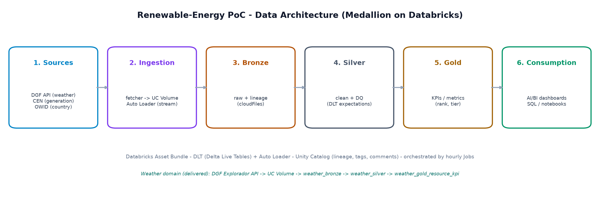

# poc_databricks_evalueserve

Renewable-energy **data-engineering PoC** on **Databricks** — a **medallion** (bronze → silver → gold)
lakehouse for Chilean renewable-energy data, built as a **Databricks Asset Bundle** with **DLT**
(Delta Live Tables / Lakeflow Declarative Pipelines), **Auto Loader** streaming ingestion, and
**Unity Catalog** governance.

## PoC deliverables



- 📄 **Executive summary** — [read on GitHub (`.md`)](docs/deliverables/executive-summary.md) · [download (`.pdf`)](docs/deliverables/executive-summary.pdf)
- 📘 **Technical documentation** — [read on GitHub (`.md`)](docs/deliverables/technical-documentation.md) · [download (`.pdf`)](docs/deliverables/technical-documentation.pdf)
- 🖼️ **Architecture diagram** — [`docs/deliverables/architecture.png`](docs/deliverables/architecture.png) (shown above)
- 📊 **Slide deck** — [download (`.pptx`)](docs/deliverables/poc-deck.pptx)

> GitHub renders the `.md` versions and the PNG inline; the `.pdf`/`.pptx` are download-to-view (standard GitHub behavior).

**Explore / test the live results:** [Job](https://dbc-54b27bae-2e91.cloud.databricks.com/jobs/503330163541320?o=7474645896934260) · [Pipeline](https://dbc-54b27bae-2e91.cloud.databricks.com/pipelines/c108b287-98cc-43d6-86d6-5b63a9e6b4ae?o=7474645896934260) · [Gold table](https://dbc-54b27bae-2e91.cloud.databricks.com/explore/data/workspace/dev_fuad_onate_renewable_gold_energy_chile/weather_gold_resource_kpi?o=7474645896934260) · [PR #24](https://github.com/oxiboy/poc_databricks_evalueserve/pull/24)

## Domains & data sources

| Domain | What it models | Data source (owner) |
|---|---|---|
| **Resource** — `renewable_energy_chile` | Solar/wind **generation** per plant, hourly (coordinado / real / reducciones). Silver = Data Vault (hub/link/sat); gold = daily/weekly/monthly measures + real-vs-coordinated diff. | CEN / Coordinador Eléctrico Nacional |
| **Conglomerate** — `renewable_conglomerate_energy` | Country-level (Entity/Year) renewable stats → dim/fact → gold YoY increase + Chile-vs-LATAM/World. | Our World in Data (OWID) |
| **Weather** — `weather` | DGF (U. de Chile Geophysics) solar irradiance + wind **resource** → bronze/silver/gold. *Current PoC deliverable — see PR #24 / `feat/weather-streaming`.* | DGF Explorador (`solar` / `eolico.minenergia.cl`, open API) |

> The **DGF is the owner of the *resource* (weather) data** — solar irradiance, wind — **not** the
> generation. Generation comes from the **CEN**, and country statistics from **OWID**.

## Architecture

`Sources → ingestion → BRONZE → SILVER → GOLD → consumption`, orchestrated by **Databricks Jobs**
(hourly). Ingestion lands files in a **Unity Catalog Volume**; **Auto Loader** (cloudFiles) streams
them into bronze. Pipelines are **DLT on serverless**.

Weather flow (end-to-end): `scripts/dgf_explorador_fetcher.py` pulls the DGF API → lands JSON in a
UC Volume → `weather_bronze` (Auto Loader) → `weather_silver` (clean + latest-per-plant) →
`weather_gold_resource_kpi` (per-plant resource KPI: metric, rank, tier).

## Layout

- `src/<domain>/transformations/` — DLT transformations (bronze / silver / gold).
- `resources/` — bundle resources: `pipeline/`, `jobs/`, `volume.yml`, `schema.yml`, `variables.yml`.
- `scripts/` — data acquisition (e.g. `dgf_explorador_fetcher.py`).
- `notebooks/` — walkthrough / status / data-catalog notebooks.
- `docs/` — design + data-flow docs.

## Getting started

Install dependencies with **uv** (https://docs.astral.sh/uv):

```
uv sync --dev
```

Authenticate the Databricks CLI (`databricks auth login --host <workspace-url>`), then deploy/run
the bundle. The `dev` catalog is not writable for every user, so dev deploys use the `workspace`
sandbox catalog:

```
# deploy to dev
databricks bundle deploy -t dev --var=dev_catalog=workspace

# run a pipeline or job (e.g. the weather medallion + its hourly job)
databricks bundle run weather_streaming     -t dev --var=dev_catalog=workspace   # DLT pipeline
databricks bundle run weather_streaming_job -t dev --var=dev_catalog=workspace   # fetch -> pipeline
```

Run tests: `uv run pytest`. `prod` deploys are managed by the project lead (the `prod` target is
scoped to their workspace).

## Notes

- Config lives in `databricks.yml` (targets `dev` / `prod`) + `resources/variables.yml` (catalog/schemas).
- Secrets stay in a gitignored `.env`; `databricks.yml` `sync.exclude` keeps it out of the workspace.
