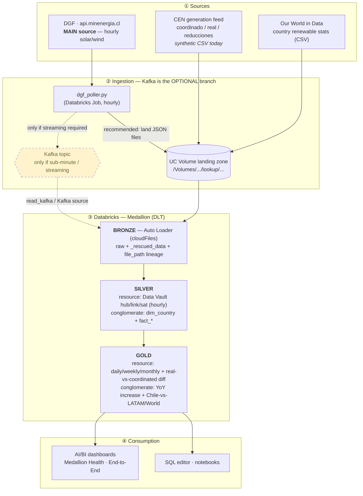

# End-to-end data workflow — and where Kafka fits

This explains how data moves from the sources to the dashboards, and clarifies the
one part that's easy to misread: **Kafka is an *optional* streaming transport, not
the backbone** of this pipeline.

## The diagram



ASCII fallback (same flow, for terminals that don't render Mermaid):

```
① SOURCES
   • DGF · api.minenergia.cl   ← MAIN (hourly solar/wind)   → via dgf_poller.py
   • CEN generation feed (coordinado/real/reducciones)      → synthetic CSV today
   • Our World in Data (country renewable stats)            → CSV
        │
        ▼
② INGESTION   (two patterns — Kafka is the OPTIONAL one)
     recommended (hourly):   poller ─▶ UC Volume (JSON/CSV landing) ─┐
     optional (streaming):   poller ┄▶ Kafka topic ┄▶ Kafka source ┄┐│
        │                                                           ▼▼
③ MEDALLION (Databricks DLT)
   BRONZE  Auto Loader (cloudFiles) — raw + _rescued_data + file_path
        ▼
   SILVER  resource: Data Vault hub/link/sat (truncated to hourly)
           conglomerate: dim_country + fact_*
        ▼
   GOLD    resource: daily/weekly/monthly measures + real-vs-coordinated diff
           conglomerate: YoY increase + Chile-vs-LATAM/World
        │
        ▼
④ CONSUMPTION
   AI/BI dashboards (Medallion Health, End-to-End) · SQL editor · notebooks
```

## Where Kafka fits (the short version)

Kafka is a **streaming message bus** — a durable buffer/transport that would sit
**between the source poller and bronze**. A producer publishes events to a *topic*;
Databricks consumes them. In the card #56 brief the data flow is written
`DGF → Kafka → Databricks`, which is why it shows up at all.

**But the agreed cadence is hourly**, and at hourly volume the recommended design
([`card-56-bronze-landing-design.md`](card-56-bronze-landing-design.md) §3) is to
**drop the managed Kafka broker**: the poller lands JSON in a UC Volume and Auto
Loader ingests it. A broker would add cost + ops with no benefit at that rate.

So Kafka is the **dashed branch** in the diagram — present as a capability, bypassed
in the recommended hourly path.

### When you *would* turn Kafka on
- **Sub-minute / true real-time** data (e.g. if DMC/DGA per-minute station feeds are added later).
- **Multiple independent consumers** of the same stream.
- **Decoupling** producer uptime from pipeline runtime, plus **replay/backfill** from the log.
- **Backpressure / buffering** for bursty, high-volume sources.

### The three landing options (from the design doc)
| Option | Path | When |
|---|---|---|
| **A — recommended** | poller → UC Volume (JSON) → Auto Loader DLT bronze, triggered hourly | hourly cadence, lowest cost, keeps `file_path` lineage |
| **B** | Kafka → DLT streaming table (`read_kafka`) directly | lowest latency; needs always-on compute + broker secrets |
| **C** | Separate continuous streaming pipeline for the Kafka source | isolate streaming cost from the working batch pipeline |

### Dev/observability note
A local Kafka (KRaft, `:9092`) + Kafka UI (`:8080`) were stood up in a prior session
to *demonstrate and observe* the streaming path — not as the production transport.
See the `reference-kafka-databricks-uis` memory for the free observability UIs.

## Layer-by-layer summary
| Stage | What happens | Code |
|---|---|---|
| **Source** | DGF API (main), CEN generation (synthetic CSV today), OWID CSV | `scripts/dgf_poller.py` |
| **Ingestion** | Hourly poll → land files in UC Volume (or Kafka, optional) | `dgf_poller.py`, `resources/volume.yml` |
| **Bronze** | Auto Loader reads the landed files; raw + `_rescued_data` + `file_path` | `transformations/bronze_*.py` |
| **Silver** | resource = Data Vault hub/link/sat (hourly); conglomerate = dim/fact | `transformations/silver_*.py` |
| **Gold** | resource = daily/weekly/monthly + diff; conglomerate = increase + comparisons | `transformations/gold_*.py` |
| **Orchestration** | hourly Job (poller) + triggered/`AvailableNow` DLT | `resources/*.job.yml`, `*.pipeline.yml` |
| **Consumption** | AI/BI dashboards, SQL editor, notebooks | `notebooks/`, Lakeview dashboards |
```
