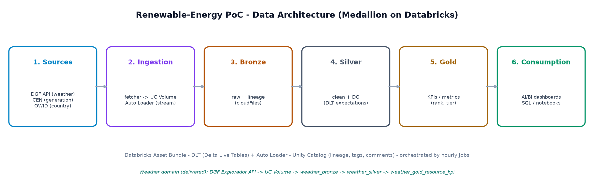
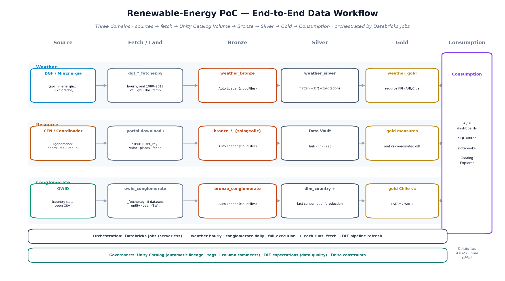

# Project Overview — Renewable-Energy Data-Engineering PoC

*Single, consolidated home for the project overview: executive summary, technical documentation, architecture & workflow diagrams, and the slide deck.*

A **medallion (bronze → silver → gold) lakehouse** on **Databricks** for Chilean renewable-energy data — built as a **Databricks Asset Bundle** with **DLT** (Delta Live Tables), **Auto Loader** streaming ingestion, and **Unity Catalog** governance, across **three domains** (Weather · Resource · Conglomerate).

---

## 📦 Deliverables

| Document | Read on GitHub | Download |
|---|---|---|
| **Executive summary** | [`executive-summary.md`](executive-summary.md) | [`.pdf`](executive-summary.pdf) |
| **Technical documentation** | [`technical-documentation.md`](technical-documentation.md) | [`.pdf`](technical-documentation.pdf) |
| **Architecture diagram** | [`architecture.png`](architecture.png) *(below)* | — |
| **End-to-end workflow** | [`workflow.png`](workflow.png) *(below)* | — |
| **Slide deck** | — | [`poc-deck.pptx`](poc-deck.pptx) |

> GitHub renders the `.md` and `.png` inline; `.pdf`/`.pptx` are download-to-view.

---

## 🏗️ Architecture



Sources → Ingestion → **Bronze → Silver → Gold** → Consumption, on serverless DLT, orchestrated by hourly/daily Databricks Jobs and governed by Unity Catalog.

## 🔄 End-to-end data workflow



Each domain flows independently through the medallion; a Databricks Job per domain runs **fetch → DLT pipeline refresh**.

---

## 🗂️ Domains & data sources

| Domain | Models | Source (owner) | Status |
|---|---|---|---|
| **Weather** (`renewable_energy_chile` — resource/weather) | Solar irradiance + wind resource, hourly | **DGF / MinEnergía** (`api.minenergia.cl` — official API, hourly real 1980–2017; Explorador as open fallback) | ✅ delivered end-to-end |
| **Resource** (`renewable_energy_chile` — generation) | Solar/wind **generation** per plant (coordinado / real / reducciones); silver = Data Vault | **CEN / Coordinador Eléctrico Nacional** (`valor`) | pipeline built; source via portal / SIPUB `user_key` |
| **Conglomerate** (`renewable_conglomerate_energy`) | Country-level stats (entity/year, TWh, %) | **Our World in Data (OWID)** — open CSV | ✅ wired to real OWID data |

**Field-by-domain rule:** the DGF/MinEnergía API covers **Weather** only; **generation** (`valor`) comes from CEN and **country** stats from OWID — they are complementary sources, not substitutes.

---

## ✅ Results (validated in dev)

- **Weather** — job runs fetch → medallion end-to-end on real data; gold = **5 solar + 5 wind** plants, ranked by resource with an A/B/C quality tier (e.g. Cerro Dominador GHI 7.28 · Negrete Cuel wind 7.85 m/s).
- **Conglomerate** — pipeline COMPLETED on real OWID series (1965–2025); gold `gold_different_renewable_again_chile`: Chile-vs-World renewables lead grew **+19 → +38** (2017→2024), Chile-vs-LATAM **−24 → −7**.

## 🔗 Explore / test the live results

- **Weather Job:** https://dbc-54b27bae-2e91.cloud.databricks.com/jobs/503330163541320?o=7474645896934260
- **Weather Pipeline:** https://dbc-54b27bae-2e91.cloud.databricks.com/pipelines/c108b287-98cc-43d6-86d6-5b63a9e6b4ae?o=7474645896934260
- **Weather GOLD table:** https://dbc-54b27bae-2e91.cloud.databricks.com/explore/data/workspace/dev_fuad_onate_renewable_gold_energy_chile/weather_gold_resource_kpi?o=7474645896934260
- **Conglomerate Pipeline:** https://dbc-54b27bae-2e91.cloud.databricks.com/pipelines/b5d63282-a439-42ef-8e3b-cd707a9d5f58?o=7474645896934260
- **Pull requests:** [#24 weather](https://github.com/oxiboy/poc_databricks_evalueserve/pull/24) · [#25 OWID conglomerate](https://github.com/oxiboy/poc_databricks_evalueserve/pull/25)

---

## 🛡️ Governance (Databricks-native)

- **Data quality / contracts:** DLT `@dlt.expect_*` expectations + Delta constraints.
- **Lineage:** Unity Catalog automatic table + column lineage.
- **Glossary:** UC tags + column comments (100% of columns) + `docs/glossary.md`.

## ▶️ Deploy & run

```bash
databricks bundle deploy -t dev --var=dev_catalog=workspace
databricks bundle run weather_streaming_job     -t dev --var=dev_catalog=workspace   # Weather
databricks bundle run conglomerate_owid_job      -t dev --var=dev_catalog=workspace   # Conglomerate (OWID)
```

Prod deploys are managed by the project lead (prod target scoped to their workspace).
