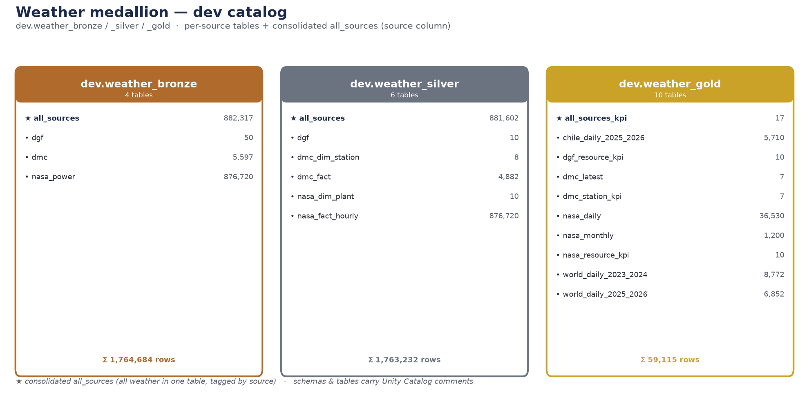
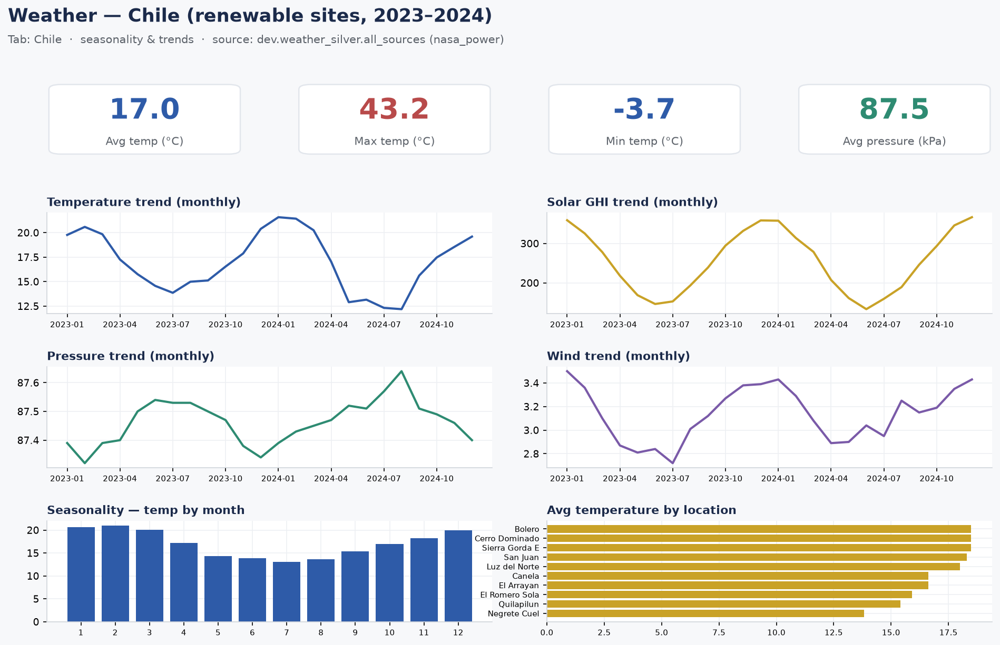
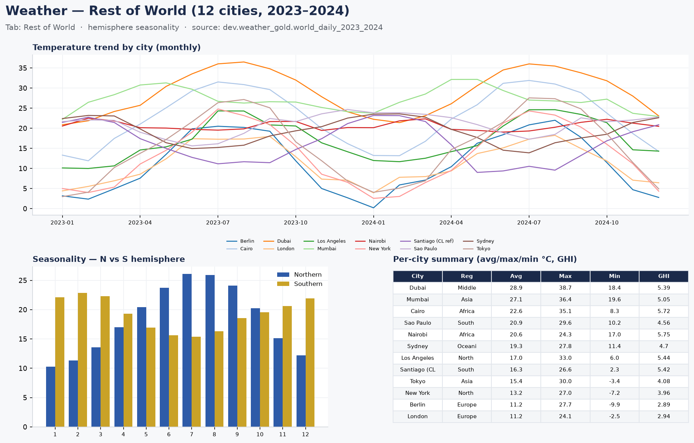

# Project Overview — Renewable-Energy Data-Engineering PoC

*Single, consolidated home for the project overview: executive summary, technical documentation, architecture & data-flow diagrams, and the slide deck.*

A **medallion (bronze → silver → gold) lakehouse** on **Databricks** for Chilean renewable-energy data — built as a **Databricks Asset Bundle** with **DLT** (Delta Live Tables), **Auto Loader** streaming ingestion, and **Unity Catalog** governance, across **three domains** (Weather · Resource · Conglomerate). *Updated 2026-07-28.*

---

## 📦 Deliverables

| Document | Read on GitHub | Download |
|---|---|---|
| **Executive summary** | [`executive-summary.md`](executive-summary.md) | [`.pdf`](executive-summary.pdf) |
| **Technical documentation** | [`technical-documentation.md`](technical-documentation.md) | [`.pdf`](technical-documentation.pdf) |
| **Architecture diagram** | [`architecture.png`](architecture.png) *(below)* | — |
| **Data-flow diagram** | [`dataflow.png`](dataflow.png) *(below)* | — |
| **End-to-end workflow** | [`workflow.png`](workflow.png) *(below)* | — |
| **Slide deck** | — | [`poc-deck.pptx`](poc-deck.pptx) |
| **Data contracts & governance** | [`../data-contracts.md`](../data-contracts.md) | — |
| **Data glossary** | [`../glossary.md`](../glossary.md) | — |

> GitHub renders the `.md` and `.png` inline; `.pdf`/`.pptx` are download-to-view.

---

## 🏗️ Architecture


Sources → Ingestion → **Bronze → Silver → Gold** → Consumption, on serverless DLT, orchestrated by hourly/daily Databricks Jobs and governed by Unity Catalog.

## 🔄 End-to-end data flow


Each source is fetched to a UC Volume, ingested via Auto Loader, and flows independently through the medallion; weather converges into consolidated `all_sources` tables and AI/BI dashboards.

---

## 🖼️ Previews (rendered from the real data & catalog)

**Weather medallion** — dev catalog, per-source + consolidated `all_sources` per layer:



**Dashboard — Chile tab** (seasonality & trends):



**Dashboard — Rest of World tab** (hemisphere seasonality, 12 cities):



> Live dashboards: [Chile & Rest of World (2 tabs)](https://dbc-54b27bae-2e91.cloud.databricks.com/sql/dashboardsv3/01f18a95d5851bb1a33415a71141a908?o=7474645896934260) · [2025–2026 YTD](https://dbc-54b27bae-2e91.cloud.databricks.com/sql/dashboardsv3/01f18a9c8d2f19a48485521da3f5a4f6?o=7474645896934260)

---

## 🗂️ Domains & data sources

| Domain | Models | Source (owner) | Status |
|---|---|---|---|
| **Weather** (`dev.weather_{bronze,silver,gold}`) | Irradiance, temperature, pressure, humidity, wind — hourly (Chile) + daily (world) | **NASA POWER** (history + 12-city world), **DMC** (real-time), **MinEnergía/DGF** (modeled) | ✅ officialized: per-source + consolidated `all_sources` |
| **Resource** (`renewable_energy_chile` — generation) | Solar/wind **generation** per plant (coordinado / real / reducciones); silver = Data Vault | **CEN / Coordinador Eléctrico Nacional** (public by law) | ✅ pipeline built on real data |
| **Conglomerate** (`renewable_conglomerate_energy`) | Country-level stats (entity/year, TWh, %) | **Our World in Data (OWID)** — open CSV | ✅ wired to real OWID data |

---

## ✅ Results (validated in dev)

- **Weather** — all sources consolidated in dedicated `weather_bronze/silver/gold` schemas (per-source + `all_sources`); 10-year hourly load (876,720 rows) modeled as star schema + marts; **12-city world benchmark** added (hemisphere inversion verified).
- **Dashboards** — **Chile & Rest of World** (2 tabs; seasonality, trends, max/min/means of temperature, GHI, pressure, wind) + a **2025–2026 YTD** twin + **Weather NASA** (series + KPIs).
- **Conglomerate** — pipeline COMPLETED on real OWID series; Chile-vs-World renewables lead grew **+19 → +38** (2017→2024).

## 🔗 Explore / test the live results

- **Weather — Chile & Rest of World (2 tabs):** https://dbc-54b27bae-2e91.cloud.databricks.com/sql/dashboardsv3/01f18a95d5851bb1a33415a71141a908?o=7474645896934260
- **Weather — Chile & Rest of World, 2025–2026 YTD:** https://dbc-54b27bae-2e91.cloud.databricks.com/sql/dashboardsv3/01f18a9c8d2f19a48485521da3f5a4f6?o=7474645896934260
- **Weather gold schema:** https://dbc-54b27bae-2e91.cloud.databricks.com/explore/data/dev/weather_gold?o=7474645896934260
- **Conglomerate Pipeline:** https://dbc-54b27bae-2e91.cloud.databricks.com/pipelines/b5d63282-a439-42ef-8e3b-cd707a9d5f58?o=7474645896934260
- **Pull requests:** https://github.com/oxiboy/poc_databricks_evalueserve/pulls · delivery consolidated in **Trello #74**

---

## 🛡️ Governance (Databricks-native)

- **Data quality / contracts:** DLT `@dlt.expect_*` expectations + Delta constraints; per-step contracts in `docs/data-contracts.md`.
- **Lineage:** Unity Catalog automatic table + column lineage.
- **Glossary & comments:** UC tags + column/table comments + `docs/glossary.md`.
- **Monitoring:** three Data-Quality Monitors on gold + a SQL alert on failed expectations.

## ▶️ Deploy & run

```bash
databricks bundle deploy -t dev --var=dev_catalog=workspace
databricks bundle run weather_streaming_job     -t dev --var=dev_catalog=workspace   # Weather
databricks bundle run conglomerate_owid_job      -t dev --var=dev_catalog=workspace   # Conglomerate (OWID)
databricks bundle run cen_generation_job         -t dev --var=dev_catalog=workspace   # Resource (CEN)
```

Prod deploys are managed by the project lead (prod target scoped to their workspace).
