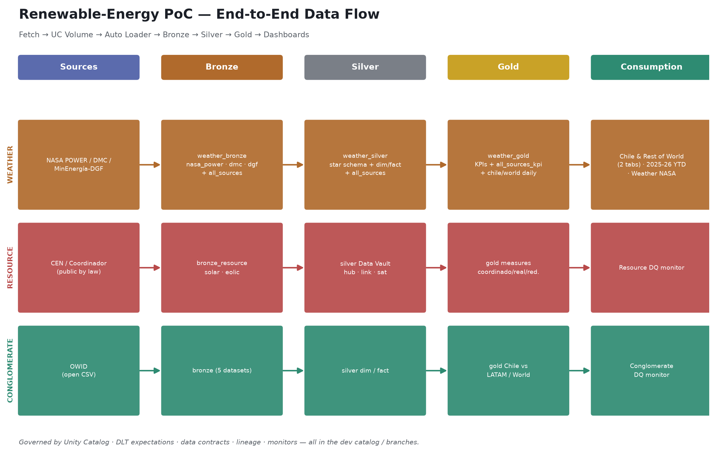

# Renewable-Energy PoC — Technical Documentation

*Medallion lakehouse on Databricks | updated 2026-07-28*

## 1. Architecture

Databricks Asset Bundle with DLT (Delta Live Tables) pipelines on serverless, Auto Loader
(cloudFiles) ingestion from Unity Catalog Volumes, and Unity Catalog governance. Flow:
Sources → Ingestion → Bronze → Silver → Gold → Consumption, orchestrated by Databricks Jobs and
monitored with Lakehouse Data-Quality Monitors.





## 2. Domains & data sources

- **Weather** — solar irradiance + wind resource. Sources by role: **NASA POWER** = historical
  hourly (measured-equivalent) + a 12-city world daily benchmark, **DMC** = real-time measured
  stations, **MinEnergía/DGF** = modeled resource (typical year / 1980–2017).
- **Resource** (`renewable_energy_chile` generation): per-plant generation coordinado/real/reducciones.
  Source: **CEN / Coordinador**. Silver = Data Vault (hub/link/sat).
- **Conglomerate** (`renewable_conglomerate_energy`): country stats (Entity/Year). Source: **OWID**.

## 3. Weather medallion — dedicated schemas (dev catalog)

All weather is officialized under three schemas, each holding **per-source tables plus one
consolidated `all_sources` table** (a `source` column tags every row):

| Layer | Schema | Tables |
|---|---|---|
| Bronze | `dev.weather_bronze` | `nasa_power`, `dmc`, `dgf`, **`all_sources`** (882,317) |
| Silver | `dev.weather_silver` | `nasa_dim_plant`, `nasa_fact_hourly`, `dmc_dim_station`, `dmc_fact`, `dgf`, **`all_sources`** (881,602) |
| Gold | `dev.weather_gold` | `nasa_resource_kpi`, `nasa_daily`, `nasa_monthly`, `dmc_latest`, `dmc_station_kpi`, `dgf_resource_kpi`, **`all_sources_kpi`**, + dashboard-serving tables `chile_daily_2025_2026`, `world_daily_2023_2024`, `world_daily_2025_2026` |

Schemas and key tables carry Unity Catalog `COMMENT`s (self-documenting); naming is symmetric by
region/period. The consolidated `all_sources` shape is
`source, location, location_type, resource, lat, lon, momento, ghi, temperatura, humedad, presion, agua_caida, viento, direccion_viento`.

## 4. Data acquisition (fetchers → UC Volume → Auto Loader)

| Fetcher (`scripts/`) | Source | Endpoint / access | Notes |
|---|---|---|---|
| `nasa_power_fetcher.py` | NASA POWER | `power.larc.nasa.gov/api/temporal/hourly/point` (no auth) | historical hourly by lat/lon; yearly chunks; DMC-equivalent fields |
| `dmc_ema_fetcher.py` | DMC / meteochile | `getDatosRecientesEma/<code>?usuario&token` | real-time measured, last 12 h, per-minute |
| `dgf_explorador_fetcher.py` | DGF Explorador | `python-router` (no auth) | modeled typical-year |
| `minenergia_api_fetcher.py` | MinEnergía official API | `POST /api/proxy` (session cookie) | hourly 1980–2017 |
| `cen_coordinador_fetcher.py` | CEN / Coordinador | `sipubv1.api.coordinador.cl/api/v1` (public key) | generation per plant; public by law |
| `owid_conglomerate_fetcher.py` | OWID | grapher CSVs (no auth) | 5 country datasets |

## 5. Weather — NASA POWER load & world benchmark

- **Historical (Chile):** hourly `ALLSKY_SFC_SW_DWN` (GHI), `T2M`, `RH2M`, `PS`, `PRECTOTCORR`,
  `WS10M/WD10M/WS50M` per plant coordinate, in **yearly chunks**. **Full load: 876,720 rows**
  (10 plants × 87,672 hours, **2015–2024**) → UC Volume → bronze → silver star schema
  (`nasa_dim_plant` + `nasa_fact_hourly`, `@expect_all_or_drop`) → gold marts
  (`nasa_resource_kpi` with rank + A/B/C tier, `nasa_daily` 36,530, `nasa_monthly` 1,200).
  Physically validated: midday GHI highest for the Atacama plants (~871 W/m²).
- **World benchmark:** NASA POWER **daily** for **12 cities across all continents** (Santiago, São
  Paulo, New York, Los Angeles, London, Berlin, Cairo, Nairobi, Dubai, Mumbai, Tokyo, Sydney),
  landed in `world_daily_2023_2024` (8,772) and `world_daily_2025_2026` (6,852). Northern-vs-
  Southern hemisphere inversion verified (London Jan 4 °C / Jul 17 °C vs Sydney Jan 23 °C / Jul 14 °C).

## 6. Consumption — AI/BI dashboards (Lakeview)

- **Weather — Chile & Rest of World** (`01f18a95…`): one dashboard, two tabs. Seasonality & trends,
  max/min/means of temperature, GHI, pressure, wind; per-location and per-city breakdowns;
  hemisphere seasonality bar.
- **Weather — Chile & Rest of World, 2025–2026 YTD** (`01f18a9c…`): the same views on the latest data.
- **Weather NASA** (`01f18771…`): time series + resource-KPI table.
- Lakeview note: charts render with `disaggregated:false` + aggregation in the field expression;
  tables need `disaggregated:true` + a pre-aggregated dataset.

## 7. Data quality, contracts & observability (Databricks-native)

- **Contracts:** documented per medallion step in [`../data-contracts.md`](../data-contracts.md).
- **In-pipeline DQ:** DLT `@dlt.expect_*` on the silver layers (Chile-bounds coords, known resource, has-metric, valid keys/dates) + UC constraints.
- **Lineage & glossary:** Unity Catalog automatic lineage + column/table comments; [`../glossary.md`](../glossary.md).
- **Monitoring:** three **Data-Quality Monitors** on the gold tables (profiling + drift, each with an auto-generated dashboard) + a **SQL alert** that fires on failed expectations.

## 8. Deploy & run

```bash
databricks bundle deploy -t dev --var=dev_catalog=workspace
databricks bundle run weather_streaming_job    -t dev --var=dev_catalog=workspace   # Weather
databricks bundle run conglomerate_owid_job     -t dev --var=dev_catalog=workspace   # Conglomerate (OWID)
databricks bundle run cen_generation_job        -t dev --var=dev_catalog=workspace   # Resource (CEN)
```

All work is done in **dev** and on branches. Prod deploys are managed by the project lead
(prod target scoped to their workspace). Note: deploying from a branch that lacks a resource
deletes it in dev — deploy from a branch that contains everything, or merge first.

## 9. Verify the medallion, jobs & dashboards

- **Weather — Chile & Rest of World (2 tabs):** https://dbc-54b27bae-2e91.cloud.databricks.com/sql/dashboardsv3/01f18a95d5851bb1a33415a71141a908?o=7474645896934260
- **Weather — Chile & Rest of World, 2025–2026 YTD:** https://dbc-54b27bae-2e91.cloud.databricks.com/sql/dashboardsv3/01f18a9c8d2f19a48485521da3f5a4f6?o=7474645896934260
- **Weather NASA — dashboard (series + KPIs):** https://dbc-54b27bae-2e91.cloud.databricks.com/sql/dashboardsv3/01f18771593d19568e23e322277007c3?o=7474645896934260
- **Weather gold schema:** https://dbc-54b27bae-2e91.cloud.databricks.com/explore/data/dev/weather_gold?o=7474645896934260
- **Resource pipeline:** https://dbc-54b27bae-2e91.cloud.databricks.com/pipelines/9bcfc32a-19f0-4327-b5bc-e8ee1cc4a3a4?o=7474645896934260
- **Conglomerate pipeline:** https://dbc-54b27bae-2e91.cloud.databricks.com/pipelines/b5d63282-a439-42ef-8e3b-cd707a9d5f58?o=7474645896934260
- **Weather pipeline:** https://dbc-54b27bae-2e91.cloud.databricks.com/pipelines/c108b287-98cc-43d6-86d6-5b63a9e6b4ae?o=7474645896934260
- **Quality monitors:** [Resource](https://dbc-54b27bae-2e91.cloud.databricks.com/sql/dashboardsv3/01f1809adb1a199384b80e96c469a206?o=7474645896934260) · [Weather](https://dbc-54b27bae-2e91.cloud.databricks.com/sql/dashboardsv3/01f1809ae54812c08231e73a5350f27c?o=7474645896934260) · [Conglomerate](https://dbc-54b27bae-2e91.cloud.databricks.com/sql/dashboardsv3/01f1809ae61519be89d4cf09780d51d6?o=7474645896934260)
